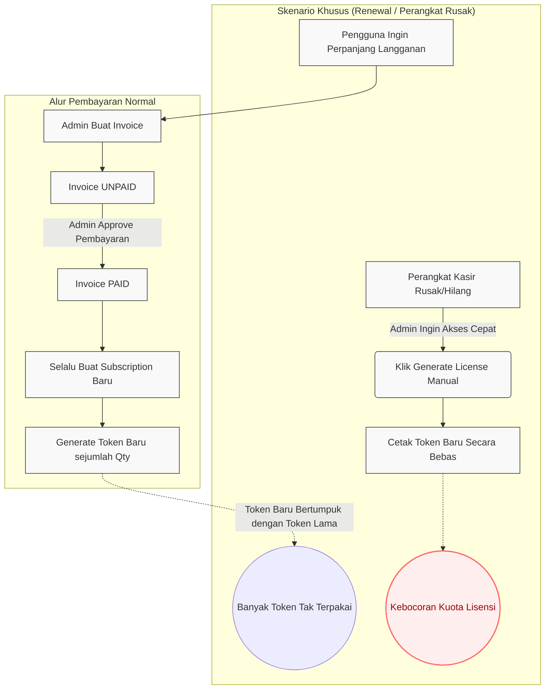
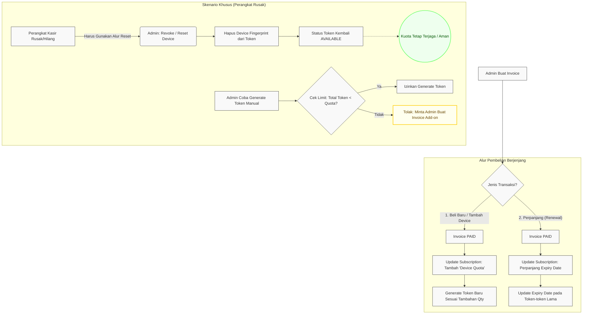

# Perbandingan Alur Sistem (Saat Ini vs Usulan Perbaikan)

Berikut adalah flowchart yang menggambarkan perbedaan alur kerja antara sistem yang berjalan saat ini dengan usulan arsitektur yang lebih ketat (*strict*) untuk menangani lisensi, tagihan, dan batas perangkat.

## 1. Alur Sistem Saat Ini (Terdapat Celah)

Pada sistem saat ini, setiap pembayaran tagihan (invoice) akan selalu membuat langganan baru. Selain itu, terdapat fitur "Generate License" yang memungkinkan admin membuat token baru secara bebas tanpa terikat pada tagihan (bisa menyebabkan kebocoran kuota).

## 2. Saran Alur Sistem Baru (Terkontrol & Aman)

Pada usulan alur ini, kita memisahkan niat pembelian menjadi **Renewal** (Perpanjang masa aktif tanpa tambah perangkat) dan **Add-on** (Tambah perangkat baru). Selain itu, untuk masalah perangkat rusak, admin tidak diperbolehkan mencetak token baru, melainkan me-*reset* token lama.

### Penjelasan Perbaikan Kunci:
1. **Atribut `Device Quota`**: Langganan kini memiliki batasan kuota. Token tidak bisa dibuat melebihi batas yang sudah dibayar.
2. **Renewal vs Add-on**: Perpanjangan waktu langganan tidak lagi melahirkan token-token baru yang membuat pangkalan data menjadi kotor (*redundant*).
3. **Mekanisme Reset**: Menghilangkan kebiasaan *bypass* pembuatan token baru. Cukup hapus *binding* alat kasir yang lama, sehingga *Token Key* yang sama bisa dipakai di alat pengganti tanpa merusak limit lisensi.
